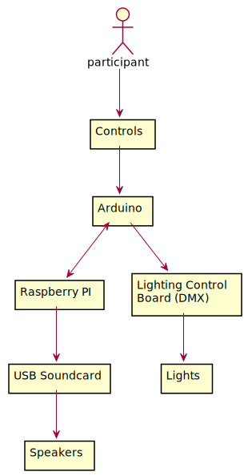

# Pink Pulsating Pancreas

The Pink Pulsating Pancreas is a scale model of a human pancreas, designed to be entertaining and educational. It's lit from the inside with user-controlled
lighting fixtures, and plays pancreas facts from built-in speakers.

[Project proposal](https://github.com/scjody/pancreas/files/7597182/Pink.Pulsating.Pancreas.pdf) - yes, I actually got an art grant to build this!

[Audio](https://soundcloud.com/scjody/sets/pink-pulsating-pancreas) - **WARNING: most of these are really strange!**

## Architecture

Most of the work is done on a Raspberry Pi running Pure Data. An Arduino-like
MCU is used to read from the fader bank and output DMX.

## MCU software

The MCU controls DMX lighting fixtures, and will probably handle all
aspects of that, accepting a mode and some basic parameters from Pure
Data. The MCU also reads from the fader bank.

This software was designed to run on a
[dmxfire16](https://github.com/propane-and-electrons/dmxfire16), but should
work on any Arduino-ish (ATmega328) platform.

The [DMXSerial](http://www.mathertel.de/Arduino/DMXSerial.aspx) library
(v1.4.0) is required, and can be installed using the Arduino Library Manager.

## Raspberry PI

The main controls are written in Pure Data. (Purr Data Version 2.5.1 (20180414-rev.8916c70) was used.)
